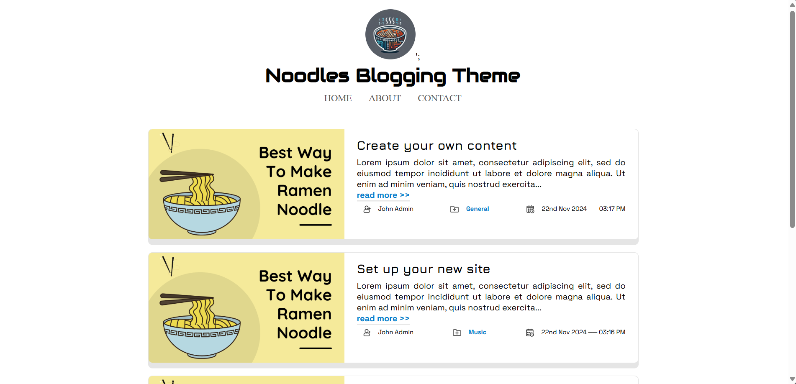

# [NOODLES](https://msio.me)

This is a simple, free, and lightweight [BLUDIT](https://www.bludit.com/) blogging theme with social icons and static pages.

## Features
- SEO Friendly
- Responsive & lightweight
- Cross browser compatibility
- Font Awesome Social Icons 
- Prism JS
- Disqus comment support

## Prerequisite
- Bludit v3.x
- Makesure to activate TinyMCE and Disqus plugins
## Author
- Muhammed [🔗](https://msio.me)

## Screenshot
- 

## License

This software is licensed under the [MIT license](./LICENSE).
